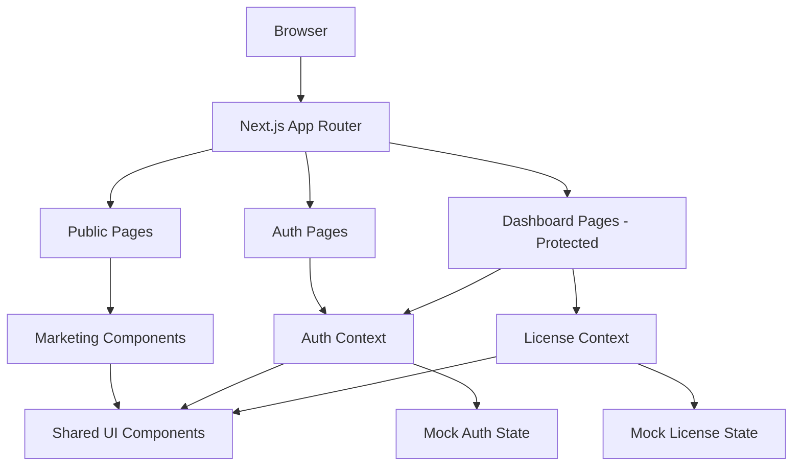

# Design Document: Stealth Anti-Cheat Platform

## Overview

Stealth is a premium anti-cheat marketing and dashboard platform built as a Next.js 14 (App Router) application with React, TypeScript, and Tailwind CSS. The platform serves two distinct audiences:

1. **Public visitors** — the marketing site (landing page, pricing, trust pages, docs, bug bounty)
2. **Authenticated users** — the dashboard (license management, downloads, API keys, team management, account settings)

The entire implementation is frontend-only with mock state. All backend-dependent operations (real payments, license cryptography, HWID binding, actual 2FA, webhook delivery) are simulated with in-memory context and placeholder UI flows, with code comments indicating backend integration points.

The aesthetic is **cyberpunk/cybersecurity dark**: near-black background (`#0a0a0f`), electric cyan (`#00f0ff`) and violet (`#8b5cf6`) accent gradients, glassmorphism cards, subtle grid/circuit-line backgrounds, monospace elements for technical data, and glow/neon hover effects.

## Architecture

### Technology Stack

| Layer | Technology | Rationale |
|---|---|---|
| Framework | Next.js 14 (App Router) | File-based routing, RSC support, built-in image optimization |
| Language | TypeScript | Type safety for data models and component props |
| Styling | Tailwind CSS v3 | Utility-first, easy dark theme, responsive utilities |
| Animations | Framer Motion | Scroll reveals, counter animations, hover transitions |
| Icons | Lucide React | Consistent, tree-shakeable icon set |
| State | React Context + useReducer | Lightweight mock auth/license state without external deps |
| Forms | React Hook Form + Zod | Validation and schema-driven error messages |
| Toast | Sonner | Minimal toast notification library |

### Routing Structure

```
app/
├── layout.tsx                    # Root layout (fonts, global providers)
├── page.tsx                      # Landing page (/)
├── pricing/
│   └── page.tsx                  # Pricing detail page (/pricing)
├── checkout/
│   └── page.tsx                  # Checkout flow (/checkout)
├── auth/
│   ├── login/
│   │   └── page.tsx              # Login (/auth/login)
│   ├── register/
│   │   └── page.tsx              # Registration (/auth/register)
│   ├── forgot-password/
│   │   └── page.tsx              # Password reset (/auth/forgot-password)
│   └── 2fa-setup/
│       └── page.tsx              # 2FA enrollment (/auth/2fa-setup)
├── dashboard/
│   ├── layout.tsx                # Dashboard shell with sidebar
│   ├── page.tsx                  # Overview (/dashboard)
│   ├── downloads/
│   │   └── page.tsx              # Downloads (/dashboard/downloads)
│   ├── license/
│   │   └── page.tsx              # License management (/dashboard/license)
│   ├── api-keys/
│   │   └── page.tsx              # API keys (/dashboard/api-keys)
│   ├── team/
│   │   └── page.tsx              # Team management (/dashboard/team)
│   ├── settings/
│   │   └── page.tsx              # Account settings (/dashboard/settings)
│   └── support/
│       └── page.tsx              # Support (/dashboard/support)
├── status/
│   └── page.tsx                  # Public status page (/status)
├── changelog/
│   └── page.tsx                  # Changelog (/changelog)
├── builds/
│   └── page.tsx                  # Verified builds/checksums (/builds)
├── docs/
│   └── page.tsx                  # Documentation (/docs)
├── bug-bounty/
│   └── page.tsx                  # Bug bounty program (/bug-bounty)
└── report/
    └── page.tsx                  # False positive / cheat report (/report)
```

### Application Layers



### Route Protection Strategy

The dashboard is protected via a client-side `AuthGuard` component that reads from `AuthContext`. If `user` is null, it redirects to `/auth/login` with a `?redirect` query parameter. This is a frontend mock — no real JWT verification occurs.

```
dashboard/layout.tsx
  └── AuthGuard (client component)
        ├── reads AuthContext.user
        ├── if null → redirect to /auth/login
        └── if present → render children with DashboardShell
```

## Components and Interfaces

### Component Tree Overview

```
src/
├── components/
│   ├── ui/                        # Primitive UI components
│   │   ├── Button.tsx
│   │   ├── Card.tsx               # Glassmorphism card base
│   │   ├── Badge.tsx
│   │   ├── Input.tsx
│   │   ├── Modal.tsx
│   │   ├── Toast.tsx
│   │   ├── Tooltip.tsx
│   │   ├── Accordion.tsx
│   │   └── CopyButton.tsx         # One-click clipboard copy with feedback
│   ├── layout/
│   │   ├── Navbar.tsx             # Public site navigation
│   │   ├── Footer.tsx             # Public site footer
│   │   ├── DashboardShell.tsx     # Dashboard outer wrapper
│   │   ├── Sidebar.tsx            # Dashboard sidebar navigation
│   │   └── MobileNav.tsx          # Mobile hamburger menu
│   ├── marketing/                 # Landing page sections
│   │   ├── HeroSection.tsx
│   │   ├── FeatureGrid.tsx
│   │   ├── HowItWorks.tsx
│   │   ├── ComparisonTable.tsx
│   │   ├── PricingCards.tsx
│   │   ├── TrustSection.tsx
│   │   ├── Testimonials.tsx
│   │   ├── FaqAccordion.tsx
│   │   └── StatsCounter.tsx
│   ├── dashboard/
│   │   ├── LicenseStatusCard.tsx
│   │   ├── ActivityFeed.tsx
│   │   ├── BuildCard.tsx
│   │   ├── DeviceList.tsx
│   │   ├── ApiKeyRow.tsx
│   │   ├── TeamMemberRow.tsx
│   │   └── DownloadButton.tsx
│   ├── auth/
│   │   ├── LoginForm.tsx
│   │   ├── RegisterForm.tsx
│   │   ├── TwoFactorSetup.tsx
│   │   └── TwoFactorPrompt.tsx
│   └── effects/
│       ├── GridBackground.tsx     # Animated circuit/grid background
│       ├── GlowBorder.tsx         # CSS glow wrapper
│       ├── ScrollReveal.tsx       # Framer Motion scroll animation wrapper
│       └── CounterAnimation.tsx   # Number count-up animation
├── contexts/
│   ├── AuthContext.tsx
│   └── LicenseContext.tsx
├── hooks/
│   ├── useAuth.ts
│   ├── useLicense.ts
│   ├── useClipboard.ts
│   └── useCountUp.ts
├── lib/
│   ├── mock-data.ts               # Seed data for mock state
│   ├── validators.ts              # Zod schemas
│   └── utils.ts                  # cn(), formatDate(), etc.
└── types/
    └── index.ts                   # Shared TypeScript types
```

### Key Component Interfaces

#### Card (Glassmorphism Base)

```typescript
interface CardProps {
  children: React.ReactNode;
  variant?: 'default' | 'highlighted' | 'danger';
  glow?: boolean;           // enables neon border glow
  className?: string;
}
```

Renders with: `bg-white/5 backdrop-blur-md border border-white/10 rounded-xl`
Highlighted variant adds: `border-cyan-500/50 shadow-[0_0_20px_rgba(0,240,255,0.15)]`

#### Button

```typescript
interface ButtonProps {
  variant?: 'primary' | 'secondary' | 'ghost' | 'danger';
  size?: 'sm' | 'md' | 'lg';
  glow?: boolean;
  loading?: boolean;
  icon?: React.ReactNode;
  children: React.ReactNode;
}
```

Primary button: `bg-gradient-to-r from-cyan-500 to-violet-600 hover:shadow-[0_0_20px_rgba(0,240,255,0.4)]`

#### ScrollReveal

```typescript
interface ScrollRevealProps {
  children: React.ReactNode;
  direction?: 'up' | 'down' | 'left' | 'right';
  delay?: number;           // milliseconds
  className?: string;
}
```

Uses Framer Motion `useInView` to trigger `opacity: 0 → 1` and `y: 20 → 0` animations when the element enters the viewport.

#### Sidebar Navigation

```typescript
interface SidebarItem {
  label: string;
  href: string;
  icon: React.ReactNode;
  badge?: string;           // e.g., "New"
  requiresLicense?: boolean;
}

const sidebarItems: SidebarItem[] = [
  { label: 'Overview',   href: '/dashboard',           icon: <LayoutDashboard /> },
  { label: 'Downloads',  href: '/dashboard/downloads', icon: <Download /> },
  { label: 'License',    href: '/dashboard/license',   icon: <Key /> },
  { label: 'API Keys',   href: '/dashboard/api-keys',  icon: <Code2 /> },
  { label: 'Team',       href: '/dashboard/team',      icon: <Users /> },
  { label: 'Settings',   href: '/dashboard/settings',  icon: <Settings /> },
  { label: 'Support',    href: '/dashboard/support',   icon: <HelpCircle /> },
  { label: 'Docs',       href: '/docs',                icon: <BookOpen /> },
];
```

## Data Models

All data models are TypeScript interfaces. Mock instances are seeded in `lib/mock-data.ts`.

### User

```typescript
interface User {
  id: string;                      // UUID
  username: string;
  email: string;
  avatarUrl?: string;
  createdAt: Date;
  twoFactorEnabled: boolean;
  role: 'user' | 'admin';
}
```

### License

```typescript
type LicenseTier = 'usermode' | 'kernel';
type LicenseStatus = 'active' | 'expired' | 'suspended' | 'none';

interface License {
  id: string;
  userId: string;
  tier: LicenseTier;
  status: LicenseStatus;
  licenseKey: string;              // display format: STLTH-XXXX-XXXX-XXXX-XXXX
  purchasedAt: Date;
  expiresAt: Date | null;          // null = lifetime
  maxActivations: number;
  activations: Activation[];
  seats?: number;                  // for team licenses
  usedSeats?: number;
}

interface Activation {
  id: string;
  licenseId: string;
  hwid: string;                    // truncated display: "A1B2...F9G0"
  deviceName: string;
  ipAddress: string;
  activatedAt: Date;
  lastSeenAt: Date;
  isActive: boolean;
}
```

### Build

```typescript
interface Build {
  id: string;
  version: string;                 // semver: "2.4.1"
  releasedAt: Date;
  changelogSummary: string;
  changelogItems: string[];
  sha256: string;                  // 64-char hex string
  isSigned: boolean;
  downloads: {
    exe?: string;                  // mock download URL
    sourceZip?: string;            // only for kernel tier + 2FA
  };
  tier: LicenseTier | 'all';
}
```

### APIKey

```typescript
type APIKeyEnvironment = 'production' | 'sandbox';

interface APIKey {
  id: string;
  userId: string;
  name: string;
  keyPreview: string;              // "sk_live_xxxx...xxxx" (masked)
  fullKey?: string;                // only populated on creation, then discarded
  environment: APIKeyEnvironment;
  createdAt: Date;
  lastUsedAt: Date | null;
  isActive: boolean;
  webhooks: WebhookConfig[];
}

interface WebhookConfig {
  id: string;
  apiKeyId: string;
  type: 'discord' | 'slack' | 'custom';
  url: string;
  events: ('ban' | 'flag' | 'detection')[];
  isActive: boolean;
}
```

### TeamMember

```typescript
type TeamMemberStatus = 'active' | 'pending' | 'revoked';

interface TeamMember {
  id: string;
  teamLicenseId: string;
  email: string;
  username?: string;
  status: TeamMemberStatus;
  invitedAt: Date;
  activatedAt: Date | null;
  subLicenseKey: string;
  hwid?: string;
}
```

### ActivityEvent

```typescript
type ActivityEventType =
  | 'login'
  | 'download'
  | 'license_activated'
  | 'hwid_reset'
  | 'api_key_generated'
  | 'api_key_revoked'
  | 'team_member_added'
  | 'team_member_removed'
  | '2fa_enabled'
  | '2fa_disabled';

interface ActivityEvent {
  id: string;
  userId: string;
  type: ActivityEventType;
  description: string;
  ipAddress: string;
  timestamp: Date;
  metadata?: Record<string, unknown>;
}
```

### Auth State

```typescript
interface AuthState {
  user: User | null;
  isLoading: boolean;
  isAuthenticated: boolean;
  pendingTwoFactor: boolean;       // true when awaiting 2FA code after password
}

type AuthAction =
  | { type: 'LOGIN_SUCCESS'; payload: User }
  | { type: 'LOGIN_PENDING_2FA' }
  | { type: 'TWO_FACTOR_SUCCESS'; payload: User }
  | { type: 'LOGOUT' }
  | { type: 'REGISTER_SUCCESS'; payload: User }
  | { type: 'SET_LOADING'; payload: boolean };
```

### License Context State

```typescript
interface LicenseState {
  license: License | null;
  builds: Build[];
  activityFeed: ActivityEvent[];
  apiKeys: APIKey[];
  teamMembers: TeamMember[];
  isLoading: boolean;
}
```

## Correctness Properties

*A property is a characteristic or behavior that should hold true across all valid executions of a system — essentially, a formal statement about what the system should do. Properties serve as the bridge between human-readable specifications and machine-verifiable correctness guarantees.*

### Property 1: Form validation rejects whitespace-only required fields and isolates errors to invalid fields

*For any* form with one or more required fields, where any subset of those fields contains only whitespace characters (spaces, tabs, newlines), the system SHALL (a) reject the submission, (b) display validation error messages only for the fields that failed validation, and (c) display no error for fields that contain valid data.

**Validates: Requirements 4.4, 19.1, 19.5**

---

### Property 2: Counter animation converges to target value

*For any* positive integer target value passed to the count-up animation hook, the animated counter SHALL start at 0 and SHALL reach exactly the target value upon animation completion, regardless of the magnitude of the target.

**Validates: Requirements 3.3**

---

### Property 3: API Key reveal-once invariant

*For any* generated API key, the `fullKey` field SHALL be present in the returned object at the moment of creation and SHALL be absent (`undefined`) in all subsequent listings of that key in the active key list.

**Validates: Requirements 10.2**

---

### Property 4: License seat accounting invariant

*For any* team license state after any sequence of add-member and remove-member operations, the derived `usedSeats` count SHALL equal the number of team members with `status === 'active'`, and `usedSeats` SHALL never exceed the license's total `seats` capacity.

**Validates: Requirements 11.3, 11.4, 11.5**

---

### Property 5: Source code download gating

*For any* combination of user `twoFactorEnabled` (boolean) and license `tier` ('usermode' | 'kernel'), the source code download UI element SHALL be rendered if and only if both `tier === 'kernel'` AND `twoFactorEnabled === true`. For all other combinations, the element SHALL be absent and a prompt SHALL be shown instead.

**Validates: Requirements 8.3, 8.4**

---

### Property 6: Activity feed descending timestamp ordering

*For any* sequence of activity events appended to the feed in any order, the resulting feed list SHALL always be sorted by `timestamp` in descending order (most recent first), and appending a new event SHALL NOT mutate or reorder any previously existing entries.

**Validates: Requirements 7.4**

---

### Property 7: License-gated content exclusion

*For any* user with `license === null` or `license.status !== 'active'`, all download action buttons and source code sections in the Downloads page SHALL be replaced by a license purchase CTA. No download affordance SHALL be rendered regardless of the user's license tier.

**Validates: Requirements 8.6, 9.6**

---

### Property 8: HWID deactivation reflects immediately in active device list

*For any* activation record in `license.activations`, after the deactivate operation is called with that activation's `id`, the record's `isActive` field SHALL be `false`, and the activation SHALL NOT appear in the list of active devices filtered by `isActive === true`.

**Validates: Requirements 9.5**

---

### Property 9: API key revocation removes key from active list

*For any* API key with `isActive === true` in the key list, after the revoke operation is called with that key's `id`, the key SHALL have `isActive === false` and SHALL NOT appear in the list of keys filtered by `isActive === true`.

**Validates: Requirements 10.3**

---

### Property 10: Toast notifications match form outcome

*For any* form submission where the mock handler is configured to return either success or failure, the toast notification type SHALL match the outcome: success result → success toast; error result → error toast. No toast of the wrong type SHALL be shown.

**Validates: Requirements 19.2, 19.3**

---

### Property 11: Build card renders all required metadata fields

*For any* `Build` object, the rendered `BuildCard` component SHALL display the version string, SHA-256 checksum, changelog summary, and signed-installer badge. No required field SHALL be absent from the rendered output.

**Validates: Requirements 8.5**

---

### Property 12: Login error message does not reveal which credential was wrong

*For any* pair of (email, password) that fails mock authentication (whether the email, the password, or both are wrong), the displayed error message text SHALL be identical regardless of which field caused the failure — it SHALL never indicate specifically whether the email or password was incorrect.

**Validates: Requirements 5.4**

---

## Error Handling

### Form Errors

All forms use React Hook Form with Zod schema validation. Errors are:
- **Field-level**: Displayed as small red text directly below the relevant `<Input>` component
- **Form-level**: Displayed as a banner at the top of the form (e.g., "Email already registered")
- **Async errors**: Thrown from mock async handlers are caught in `onSubmit` try/catch and surfaced as form-level errors

Zod schemas enforce:
- Email: `z.string().email()`
- Password: min 8 chars, at least one uppercase, one number
- Required strings: `z.string().min(1, "Required").trim()`
- Username: alphanumeric + underscore, 3–20 chars

### Authentication Errors

- Invalid credentials → generic message "Invalid email or password" (no enumeration)
- Account locked → "Too many attempts. Try again in X minutes." (mock: never actually locks)
- 2FA wrong code → "Invalid verification code. Please try again."

### Network/Mock Errors

All mock async operations simulate a 600–1200ms delay using `setTimeout`. Errors are simulated via an `shouldSimulateError` flag in `lib/mock-data.ts` (default `false`) so developers can test error states during development.

### Empty States

Each dashboard page has a designed empty state:
- No license: upgrade CTA card
- No API keys: "Generate your first API key" prompt
- No team members: "Invite your first team member" prompt
- No activity: "No recent activity" with shield icon

### Fallback UI

- Loading states: skeleton loaders (pulsing glassmorphism cards)
- Error boundaries: each route wrapped in an `ErrorBoundary` that shows a generic error card with a "Reload" button

## Testing Strategy

### Unit Tests (Vitest + Testing Library)

Unit tests focus on discrete logic and specific example scenarios:

- **Validators** (`lib/validators.ts`): Each Zod schema tested with valid and invalid examples
- **Mock data functions**: `generateApiKey()`, `formatLicenseKey()`, `maskHwid()` — example-based
- **Utility functions**: `cn()`, `formatDate()`, `truncate()` — example-based
- **Context reducers**: `authReducer` and `licenseReducer` — state transition examples (login, logout, add key, remove member, etc.)
- **Component rendering**: Key components rendered with mock props and snapshot-tested
- **Error states**: Each form tested with invalid inputs to confirm error messages appear

Example unit test targets:
```
__tests__/
├── validators.test.ts
├── reducers/
│   ├── authReducer.test.ts
│   └── licenseReducer.test.ts
├── utils.test.ts
└── components/
    ├── LoginForm.test.tsx
    ├── LicenseStatusCard.test.tsx
    └── ApiKeyRow.test.tsx
```

### Property-Based Tests (fast-check)

Property-based tests validate universal invariants using [fast-check](https://github.com/dubzzz/fast-check), configured to run **minimum 100 iterations** per property. Each test references the corresponding design property by tag.

**Feature: stealth-anticheat-platform**

**Property 1 — Form validation rejects whitespace-only required fields and isolates errors**
```
// Feature: stealth-anticheat-platform, Property 1: Form validation rejects whitespace-only required fields and isolates errors to invalid fields
// Generator: fc.record with fc.string().filter(s => s.trim().length === 0) for some fields, valid values for others
// Invariant: error keys in result === set of fields that contain only whitespace; no error on valid fields
```

**Property 2 — Counter animation converges to target**
```
// Feature: stealth-anticheat-platform, Property 2: Counter animation converges to target value
// Generator: fc.integer({ min: 1, max: 10_000_000 })
// Invariant: useCountUp(target) starts at 0 and final value === target
```

**Property 3 — API Key reveal-once invariant**
```
// Feature: stealth-anticheat-platform, Property 3: API Key reveal-once invariant
// Generator: fc.record({ name: fc.string({ minLength: 1 }) }) → call generateApiKey(name)
// Invariant: returned key.fullKey is defined; after addToList(key), the listed entry has fullKey === undefined
```

**Property 4 — License seat accounting invariant**
```
// Feature: stealth-anticheat-platform, Property 4: License seat accounting invariant
// Generator: fc.array(fc.record({ status: fc.oneof('active','pending','revoked') }), { minLength: 0, maxLength: 20 })
// Invariant: usedSeats === members.filter(m => m.status === 'active').length && usedSeats <= seats
```

**Property 5 — Source code download gating**
```
// Feature: stealth-anticheat-platform, Property 5: Source code download gating
// Generator: fc.record({ tier: fc.oneof(fc.constant('usermode'), fc.constant('kernel')), twoFaEnabled: fc.boolean() })
// Invariant: isSourceDownloadVisible(tier, twoFaEnabled) === (tier === 'kernel' && twoFaEnabled === true)
```

**Property 6 — Activity feed descending timestamp ordering**
```
// Feature: stealth-anticheat-platform, Property 6: Activity feed descending timestamp ordering
// Generator: fc.array(fc.record({ timestamp: fc.date() }), { minLength: 0, maxLength: 50 })
// Invariant: sorted feed: for all i, feed[i].timestamp >= feed[i+1].timestamp
```

**Property 8 — HWID deactivation reflects immediately**
```
// Feature: stealth-anticheat-platform, Property 8: HWID deactivation reflects immediately in active device list
// Generator: fc.array of Activation records + fc.nat to pick random index
// Invariant: after deactivate(activations[i].id), activations[i].isActive === false and it's absent from filter(a => a.isActive)
```

**Property 9 — API key revocation removes key from active list**
```
// Feature: stealth-anticheat-platform, Property 9: API key revocation removes key from active list
// Generator: fc.array of APIKey records + fc.nat to pick random active key
// Invariant: after revoke(keys[i].id), keys[i].isActive === false and absent from filter(k => k.isActive)
```

**Property 10 — Toast matches outcome**
```
// Feature: stealth-anticheat-platform, Property 10: Toast notifications match form outcome
// Generator: fc.boolean() for success/failure flag passed to mock submit handler
// Invariant: success=true → toastSuccess called once; success=false → toastError called once
```

**Property 11 — Build card renders all required metadata fields**
```
// Feature: stealth-anticheat-platform, Property 11: Build card renders all required metadata fields
// Generator: fc.record({ version: fc.string(), sha256: fc.hexaString({ minLength: 64, maxLength: 64 }), changelogSummary: fc.string(), isSigned: fc.boolean() })
// Invariant: rendered BuildCard HTML contains version, sha256, changelogSummary, and signed-badge when isSigned=true
```

**Property 12 — Login error message does not enumerate credentials**
```
// Feature: stealth-anticheat-platform, Property 12: Login error message does not reveal which credential was wrong
// Generator: fc.record({ email: fc.emailAddress(), password: fc.string({ minLength: 1 }) }) filtered to non-matching mock credentials
// Invariant: all error messages returned are strictly equal to the same generic string constant
```

### Integration / Smoke Tests (Playwright)

End-to-end smoke tests verify key user journeys:

1. **Auth flow**: Register → redirect to dashboard → logout → login → dashboard
2. **2FA gate**: Attempt source code download without 2FA → see prompt → "enable" 2FA → source download visible
3. **License gate**: Login as user with no license → Downloads shows CTA → Checkout flow → license active
4. **API key lifecycle**: Generate key → copy → revoke → no longer in list
5. **Team management**: Add member → seat count decrements → remove member → seat returns

These are smoke tests (1 execution each), not property tests. They verify wiring between components and context, not universal properties.

### Visual Regression (Optional)

Storybook + Chromatic can be used to snapshot key UI components (glassmorphism cards, neon buttons, dashboard layout) against visual regressions. This is optional and outside the core MVP scope.
